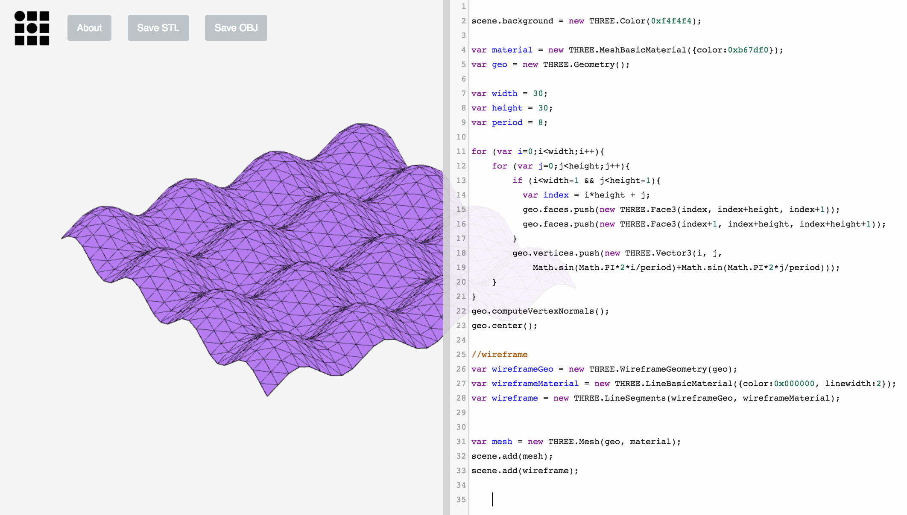

# MeshWriter

Sometimes you need a quick way to code up an triangulated  mesh. This is a [Three.js](https://threejs.org/) + [CodeMirror](https://codemirror.net/) tool to do live WebGL coding with STL and OBJ export.  

Drag to rotate, scroll to zoom, right click and drag to pan.  
Click "Save STL" to save a binary STL.  
Click "Save OBJ" to save an OBJ.  
Ctrl/⌘+S to save a .js file with your code.  
Drag to resize editor.  

Live demo at <a href="https://apps.amandaghassaei.com/MeshWriter/" target="_blank">github.amandaghassaei.com/MeshWriter</a> 

Built by [Amanda Ghassaei](http://www.amandaghassaei.com/). 
